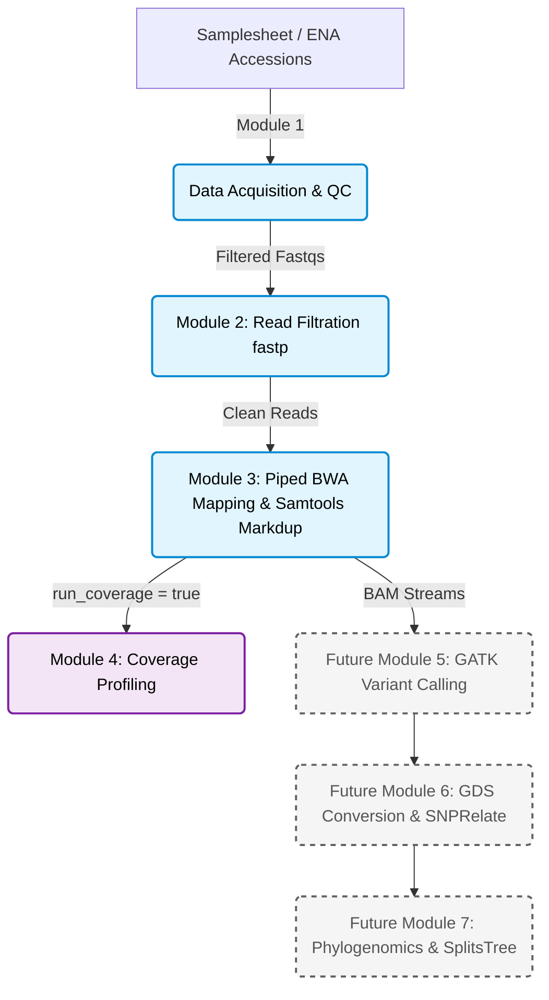

#  Saccharomyces Genomics Pipeline

A production-grade, fault-tolerant, and highly optimized Whole Genome Sequencing (WGS) variant calling and comparative phylogenomics pipeline engineered for the *Saccharomyces* genus, with a primary focus on historic lager yeast lineages and large-scale strain compendiums.

Designed to scale seamlessly from local development to massive High-Performance Computing (HPC) clusters handling thousands of genomes.

---

##  Pipeline Architecture & Workflow

The pipeline is organized into modular, independently testable Nextflow sub-workflows, scaling from raw data acquisition to deep genomic profiling and upcoming phylogenomic analysis.



---

##  Implemented Core Modules (Modules 1–4)

### [Module 1: Data Acquisition & QC Classification](https://www.google.com/search?q=../docs/MODULE_1_DATA_ACQUISITION.md)

* **High-Speed Downloads:** Primary ENA FTP retrieval via multi-threaded **`aria2c`** (`-x 16 -s 16`) to bypass server-side bandwidth throttling, backed by a secondary NCBI `prefetch` / `fasterq-dump` fallback.
* **Strict Integrity:** Automated byte-level structural testing (`gzip -t`) with exponential retry back-offs.
* **Smart Classification:** Automatically classifies runs into Paired-End (`PE_PASS`), Single-End fallback (`SE_FALLBACK`), or drops corrupt/invalid inputs while generating cohort-wide TSV summaries.

### [Module 2: Read Filtration](https://www.google.com/search?q=../docs/MODULE_2_FILTRATION.md)

* **Dual Streams:** Handles Paired-End (`FILTER_PE`) and Single-End (`FILTER_SE`) layouts independently through dedicated channel-driven processes.
* **Dynamic Parameter Injection:** Reads quality, length, and trimming configurations dynamically from `nextflow.config`, remaining dormant unless explicitly enabled.
* **Post-Filter Safety:** Enforces strict non-empty read counts and gzip structural validation post-filtering.

### Module 3: Mapping, Duplicate Marking & Alignment QC

* **Zero Disk Bloat:** Implements piped streaming (`bwa mem ... | samtools view -Sb -F 4 - | samtools sort ...`) so intermediate uncompressed alignments never touch the disk.
* **Pure-Samtools Duplicate Marking:** Completely bypasses memory-heavy Java/Picard tools (eliminating heap-space `OutOfMemoryError` crashes on local hardware) using a compiled low-level C workflow (`collate` $\rightarrow$ `fixmate` $\rightarrow$ `sort` $\rightarrow$ `markdup`).
* **Smart Reference Handling:** Supports local reference FASTAs or automated NCBI Assembly FTP fetching with pre-indexed detection (`.bwt`).

### Module 4: Genome Coverage Profiling (Optional Toggle)

* **Toggleable Execution:** Controlled via `params.run_coverage = true / false`. Skip coverage calculation during fast iterations, then flip it on and use Nextflow's `-resume` to backfill depth data instantly.
* **Sliding Window Normalization:** Computes per-base depth, converts to bedGraph, sorts against reference layouts, and calculates sliding window median coverage via `bedtools map` to eliminate local genomic noise.

---

## 🚀 Upcoming Modules & Roadmap

As the project scales toward comprehensive population genomics and evolutionary clock analysis, the following modules are currently in development:

* **Module 5: Variant Calling & Joint Genotyping (GATK)**
* Per-sample GVCF generation via `GATK HaplotypeCaller`.
* Cohort merging via `GenomicsDBImport` and joint genotyping via `GenotypeGVCFs`.
* Hard filtering of SNPs and Indels based on standard WGS filtration parameters.


* **Module 6: Matrix Formatting & Population Genetics (SNPRelate)**
* Conversion of filtered VCFs into Genomic Data Structure (`.gds`) files.
* Calculation of Identity-by-State (IBS) distance matrices and population stratification metrics.


* **Module 7: Phylogenomics & Evolutionary Divergence**
* Chromosome-specific and combined distance matrix calculations.
* Neighbor-Joining tree reconstruction via **SplitsTree** to visualize relationships within the *sensu stricto* complex.
* **Evolutionary Clock Analysis:** Molecular clock modeling in collaboration with institutional research mentors to estimate divergence timelines of historic lager lineages.


---

## 💻 Quick Start

### Prerequisites

* [Nextflow](https://www.google.com/search?q=https://www.nextflow.io/docs/latest/getstarted.html) (`>=23.10.0`)
* Container engine ([Docker](https://www.google.com/search?q=https://www.docker.com/) or [Singularity/Apptainer](https://www.google.com/search?q=https://apptainer.org/)) OR [Conda](https://www.google.com/search?q=https://docs.conda.io/)

### 1. Clone the Repository

```bash
git https://github.com/hanzala-14/saccharomyces-genomics-pipeline.git
cd saccharomyces-genomics-pipeline

```

### 2. Prepare your Samplesheet (`samplesheet.csv`)

Create a CSV file defining your strains. You can mix ENA accessions and local FASTQ paths:

```csv
strain_id,accession,r1,r2
Strain_A,SRR1234567,,
Strain_B,,/path/to/local_R1.fastq.gz,/path/to/local_R2.fastq.gz

```

### 3. Run the Pipeline

**Local Development (Conda profile):**

```bash
nextflow run main.nf -profile conda

```

**Production (Docker container profile):**

```bash
nextflow run main.nf -profile docker

```

**HPC Cluster (Singularity / SLURM profile):**

```bash
nextflow run main.nf -profile singularity

```

---

## ⚙️ Configuration & Parameters

All operational settings can be tuned inside `nextflow.config`:

```groovy
params {
    samplesheet       = 'samplesheet.csv'
    outdir            = 'results'

    // Module 1: Data Acquisition
    max_Retries       = 5
    sra_max_forks     = 4
    aria2c_connections= 16

    // Module 2: Read Filtration
    min_read_length   = 30
    qualified_quality = 20
    cut_mean_quality  = 20

    // Module 3: Mapping
    reference         = 'data/references/cer_eub/cer_eub_reference.fasta'
    min_mapping_pct   = 0

    // Module 4: Coverage Profiling (Optional Toggle)
    run_coverage      = false
    genome_file       = 'data/references/sensustricto_genomefile.tab'
    sliding_windows   = 'data/references/sensustrictoslidingwindows.bed'
}

```

---

## 📊 Output Directory Layout

```text
results/
├── pipeline_info/          # Execution reports, timelines, and DAGs
├── strains/                # Strain lists and merged FASTQs
├── filtration/             # Filtered FASTQs and multiQC-compatible JSON/HTML reports
├── reference/              # Indexed reference files and dictionaries
├── mapped/                 # Sorted BAMs, index files, and mapping summaries
└── coverage/               # Sliding window median coverage tab-delimited files (when enabled)

```

---

## 📖 Module Documentation

For deep technical specifications, input/output contracts, and command flag rationales, check the module guides:

* [Module 1: Data Acquisition](https://www.google.com/search?q=docs/MODULE_1_DATA_ACQUISITION.md)
* [Module 2: Read Filtration](https://www.google.com/search?q=docs/MODULE_2_FILTRATION.md)
* [Module 3: Mapping & Duplicate Marking](https://www.google.com/search?q=docs/MODULE_3_MAPPING.md)
* [Module 4: Coverage Profiling](https://www.google.com/search?q=docs/MODULE_4_COVERAGE.md)

---

## 📜 License

Distributed under the MIT License. See `LICENSE` for more information.