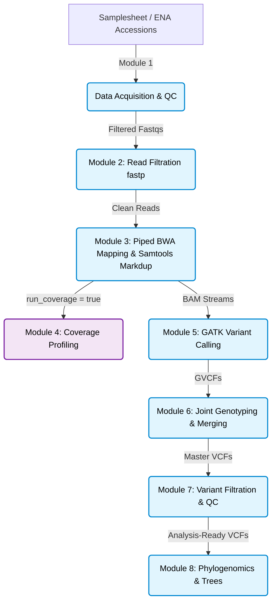

---

# Saccharomyces Genomics Pipeline

A production-grade, fault-tolerant, and highly optimized Whole Genome Sequencing (WGS) variant calling and comparative phylogenomics pipeline engineered for the *Saccharomyces* genus, with a primary focus on historic lager yeast lineages and large-scale strain compendiums.

Designed to scale seamlessly from local development to massive High-Performance Computing (HPC) clusters handling thousands of genomes.

---

## Pipeline Architecture & Workflow

The pipeline is organized into modular, independently testable Nextflow sub-workflows, scaling from raw data acquisition to deep genomic profiling, population-scale joint genotyping, strict variant filtration, and topological phylogenomics.



---

## Implemented Core Modules (Modules 1–8)

### [Module 1: Data Acquisition & QC Classification]

* **High-Speed Downloads:** Primary ENA FTP retrieval via multi-threaded **`aria2c`** (`-x 16 -s 16`) to bypass server-side bandwidth throttling, backed by a secondary NCBI `prefetch` / `fasterq-dump` fallback.
* **Strict Integrity:** Automated byte-level structural testing (`gzip -t`) with exponential retry back-offs.
* **Smart Classification:** Automatically classifies runs into Paired-End (`PE_PASS`), Single-End fallback (`SE_FALLBACK`), or drops corrupt/invalid inputs while generating cohort-wide TSV summaries.

### [Module 2: Read Filtration]

* **Dual Streams:** Handles Paired-End (`FILTER_PE`) and Single-End (`FILTER_SE`) layouts independently through dedicated channel-driven processes.
* **Post-Filter Safety:** Enforces strict non-empty read counts and gzip structural validation post-filtering.

### [Module 3: Mapping, Duplicate Marking & Alignment QC]

* **Zero Disk Bloat:** Implements piped streaming (`bwa mem ... | samtools view -Sb -F 4 - | samtools sort ...`) so intermediate uncompressed alignments never touch the disk.
* **Pure-Samtools Duplicate Marking:** Completely bypasses memory-heavy Java/Picard tools (eliminating heap-space `OutOfMemoryError` crashes on local hardware) using a compiled low-level C workflow.

### [Module 4: Genome Coverage Profiling (Optional Toggle)]

* **Toggleable Execution:** Controlled via `params.run_coverage = true / false`. Skip coverage calculation during fast iterations, then flip it on and use Nextflow's `-resume` to backfill depth data instantly.
* **Sliding Window Normalization:** Converts to bedGraph and calculates sliding window median coverage via `bedtools map` to eliminate local genomic noise.

### [Module 5: Variant Calling (GATK HaplotypeCaller)]

* **Dynamic Reference Agnosticism:** Completely eliminates hardcoded chromosome lists by dynamically parsing the `.fai` index on the fly, instantly scaling to any custom reference genome.
* **Biological Ploidy Calibration:** Features a config-driven `ploidy_map` that identifies organelle contigs (Mitochondria/Plasmids) and strictly calls them as haploids (`-ploidy 1`), preserving statistical integrity while keeping nuclear DNA diploid.

### [Module 6: Joint Genotyping & Subgenome Merging]

* **Crash-Proof Database Updates:** Utilizes an atomic Bash wrapper for `GenomicsDBImport` that safely isolates existing databases during updates, guaranteeing zero data corruption in the event of network/compute crashes.
* **Universal *Sensu Stricto* Routing:** Employs a config-based taxonomy dictionary (`species_map`) to automatically detect, isolate, and route individual subgenomes (e.g., *cerevisiae*, *eubayanus*) into clean, species-specific master VCFs.

### [Module 7: Variant Filtration & Quality Control]

* **Parallel Execution Architecture:** Splits SNPs and INDELs into independent computational streams, cutting GATK filtering execution time in half.
* **Config-Driven Mathematics:** Injects strict GATK hard-filtering thresholds directly from `nextflow.config`, ensuring zero hardcoding and high cross-species portability.
* **Biological Accuracy:** Dynamically extracts species prefixes to mask unmappable repetitive regions (e.g., Ty elements, telomeres) and automatically left-aligns INDEL coordinates to standardize downstream analysis.

### [Module 8: Phylogenomics & Evolutionary Trees]

* **C++ Identity-by-State (IBS) Engine:** Bypasses slow R loops by feeding vectorized, haploid-equivalent allele matrices into a custom OpenMP-accelerated C++ backend for high-speed genetic distance calculations.
* **Introgression Detection:** Automatically generates chromosomal-level NeighborNet networks (SplitsTree compatible) and Robinson-Foulds topological heatmaps to programmatically flag hybridization and incomplete lineage sorting.
* **Publication-Ready Exports:** Zero-hardcoded, CLI-driven R scripts dynamically route and output midpoint-rooted, bootstrapped Neighbor-Joining (NJ) trees as `.pdf`, `.nwk`, and `.nexus` files.

---

## Upcoming Modules & Roadmap

As the project scales toward comprehensive population genomics, the following modules are currently in development for subsequent releases:

* **Module 9: Functional Annotation** (Integration of `SnpEff` / `VEP` to predict the phenotypic impact of surviving variants).
* **Module 10: Admixture & Population Structure** (Automated PCA and ancestral sub-population modeling).

---

## 💻 Quick Start

### Prerequisites

* [Nextflow](https://www.nextflow.io/docs/latest/getstarted.html) (`>=23.10.0`)
* Container engine ([Docker](https://www.docker.com/) or [Singularity/Apptainer](https://apptainer.org/)) OR [Conda](https://docs.conda.io/)

### 1. Clone the Repository

```bash
git clone https://github.com/hanzala-14/saccharomyces-genomics-pipeline.git
cd saccharomyces-genomics-pipeline

```

### 2. Prepare your Samplesheet (`samplesheet.csv`)

Create a CSV file defining your strains. You can mix ENA accessions and local FASTQ paths:

```csv
strain_id,accession,r1,r2
Strain_A,SRR1234567,,
Strain_B,,/path/to/local_R1.fastq.gz,/path/to/local_R2.fastq.gz

```

### 3. Run the Pipeline

```bash
# Local Development
nextflow run main.nf -profile conda

# Production / HPC Cluster
nextflow run main.nf -profile docker

```

---

## Advanced Usage: Incremental Updates & Compendiums

This pipeline supports **incremental database ingestion**. If your lab maintains a massive compendium (e.g., a 5,000-strain GenomicsDB on an external office drive), you do **not** need to re-run historical data to joint-call new strains.

To append new samples to an existing database:

1. Create a samplesheet containing *only* your new strains.
2. Run the pipeline, passing the parent directory of your existing databases to the `genomicsdb_update_path` flag:

```bash
nextflow run main.nf \
  --samplesheet new_strains.csv \
  --genomicsdb_update_path "/media/Office_Drive/Yeast_Compendium/Joint_Genotyping" \
  -profile docker \
  -resume

```

*Nextflow will fast-track the new strains to GVCFs, safely inject them into the existing massive compendium, and spit out updated Master VCFs in a fraction of the time.*

---

## ⚙️ Configuration & Parameters

All operational settings can be tuned inside `nextflow.config`:

```groovy
params {
    samplesheet       = 'samplesheet.csv'
    outdir            = 'results'

    // Extracted Module 5 & 6 Configuration
    ploidy = 2
    ploidy_map = [ 'M': 1, 'P': 1 ] // Haploid organelles
    include_extrachromosomal = true
    
    merge_strategy = 'separate'
    extrachromosomal_strategy = 'bundled' 
    
    // Taxonomy routing dictionary
    species_map = [
        'c': 'cerevisiae', 'e': 'eubayanus', 'p': 'paradoxus',
        'm': 'mikatae', 'k': 'kudriavzevii', 'u': 'uvarum',
        'a': 'arboricola', 'j': 'jurei'
    ]
    
    // Module 7 Storage Toggles
    keep_snp_vcf         = true
    keep_indel_vcf       = true
    keep_merged_vcf      = true

    // Module 8 Phylogenomics Engine
    run_phylogeny        = true
    ibs_strategy         = 'chromosomal'
}

```

---

## Output Directory Layout

```text
results/
├── pipeline_info/          # Execution reports, timelines, and DAGs
├── strains/                # Strain lists and merged FASTQs
├── filtration/             # Filtered FASTQs and multiQC-compatible JSON reports
├── mapped/                 # Sorted BAMs, index files, and mapping summaries
├── Haplotype_Calling/      # Per-strain GVCFs and manifests
├── Joint_Genotyping/       
│   ├── c_I/                # Stateful GenomicsDB workspaces (can be updated!)
│   └── Final_Merged/       # Pre-filtration cohort VCFs
├── Variant_Filtration/     # High-fidelity, hard-filtered SNPs, INDELs, and QC reports
└── Phylogeny/              
    └── Trees/              # Publication-ready PDFs, Newick trees, and Nexus splits graphs

```

---

## 📖 Module Documentation

For deep technical specifications, input/output contracts, and command flag rationales, check the module guides:

* [`docs/MODULE_1_DATA_ACQUISITION.md`](https://www.google.com/search?q=docs/MODULE_1_DATA_ACQUISITION.md)
* [`docs/MODULE_2_READ_FILTRATION.md`](https://www.google.com/search?q=docs/MODULE_2_READ_FILTRATION.md)
* [`docs/MODULE_3_MAPPING.md`](https://www.google.com/search?q=docs/MODULE_3_MAPPING.md)
* [`docs/MODULE_4_COVERAGE.md`](https://www.google.com/search?q=docs/MODULE_4_COVERAGE.md)
* [`docs/MODULE_5_VARIANT_CALLING.md`](https://www.google.com/search?q=docs/MODULE_5_VARIANT_CALLING.md)
* [`docs/MODULE_6_JOINT_GENOTYPING.md`](https://www.google.com/search?q=docs/MODULE_6_JOINT_GENOTYPING.md)
* [`docs/MODULE_7_VARIANT_FILTRATION.md`](https://www.google.com/search?q=docs/MODULE_7_VARIANT_FILTRATION.md)
* [`docs/MODULE_8_PHYLOGENOMICS.md`](https://www.google.com/search?q=docs/MODULE_8_PHYLOGENOMICS.md)

---

## 📜 License

Distributed under the MIT License. See `LICENSE` for more information.