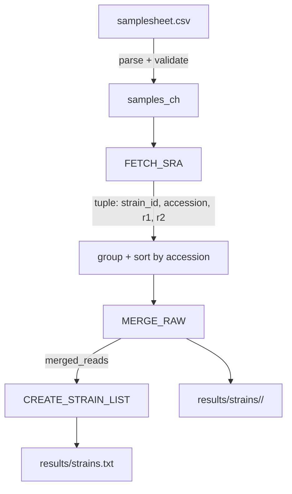

# 📖 Module 1: Data Acquisition & Strain Aggregation

* **Module Source:** [`modules/download_raw.nf`](../modules/download_raw.nf)
* **Workflow Source:** [`main.nf`](../main.nf)
* **Pipeline Configuration:** [`nextflow.config`](../nextflow.config)
* **Pipeline Version:** `1.0.0`
* **Last Updated:** 27 July 2026

---

## 1. Overview & Purpose

Module 1 performs ingestion of sequencing metadata from `samplesheet.csv`, parallel retrieval of paired-end FASTQ files from ENA, strain-level aggregation of multi-run data, and generation of a deduplicated strain manifest for downstream modules.

### Key Objectives

* **Strict input checks:** enforce required CSV headers and non-empty values.
* **Accession validation:** reject malformed run IDs before download.
* **Parallel acquisition:** download `_1` and `_2` reads concurrently with HTTP failure handling (`curl -f`).
* **Deterministic merging:** sort runs by accession before concatenation.
* **Integrity verification:** run `gzip -t` on merged outputs before publishing.
* **Manifest generation:** write deduplicated, sorted `strains.txt`.

---

## 2. Process Architecture



---

## 3. Input & Output Data Contracts

### 3.1 Input schema (`samplesheet.csv`)

| Column Header | Type | Required | Validation |
|---|---|---|---|
| `strain_id` | String | Yes | Non-empty; sanitized to `[A-Za-z0-9_.-]` for stable naming |
| `accession` | String | Yes | Must match `^[A-Z]{3}[0-9]{6,8}$` |

Example:

```csv
strain_id,accession
yHCT81-Peris,SRR2586163
yHCT81-Peris,SRR2586164
WY2007,SRR10047095
WLP830,SRR10047173
```

### 3.2 Output structure

```text
results/
├── strains.txt
└── strains/
    ├── <strain_id_1>/
    │   ├── <strain_id_1>_R1.fastq.gz
    │   └── <strain_id_1>_R2.fastq.gz
    └── <strain_id_2>/
        ├── <strain_id_2>_R1.fastq.gz
        └── <strain_id_2>_R2.fastq.gz
```

---

## 4. Process Specifications

> Resources are assigned via labels in `nextflow.config`.

### 4.1 `FETCH_SRA`

Downloads paired FASTQ files per accession from ENA.

* **Label:** `base`
* **Input:** `tuple val(strain_id), val(accession)`
* **Output:** `tuple val(strain_id), val(accession), path("${accession}_1.fastq.gz"), path("${accession}_2.fastq.gz")`
* **Behavior:**
  * validates accession format
  * builds ENA path from accession length
  * concurrent `curl` downloads
  * explicit failure checks + gzip integrity checks

---

### 4.2 `MERGE_RAW`

Merges all run FASTQs for each strain after deterministic sorting by accession.

* **Label:** `base`
* **Input:** `tuple val(strain_id), path(r1_files), path(r2_files)`
* **Output:** `tuple val(strain_id), path("${strain_id}_R1.fastq.gz"), path("${strain_id}_R2.fastq.gz")`
* **Publish:** `${params.outdir}/strains/${strain_id}` (`mode: 'copy'`)

---

### 4.3 `CREATE_STRAIN_LIST`

Creates deduplicated sorted strain manifest.

* **Label:** `tiny`
* **Input:** `val strain_ids`
* **Output:** `path "strains.txt"`
* **Publish:** `${params.outdir}` (`mode: 'copy'`)

---

## 5. Reproducibility Notes

* Run-order nondeterminism is controlled by explicit accession-based sorting before merge.
* Output integrity is enforced with `gzip -t`.
* Recommended execution command:

```bash
nextflow run main.nf -resume
```

---

## 6. Source of Truth

* [`modules/download_raw.nf`](../modules/download_raw.nf)
* [`main.nf`](../main.nf)
* [`nextflow.config`](../nextflow.config)