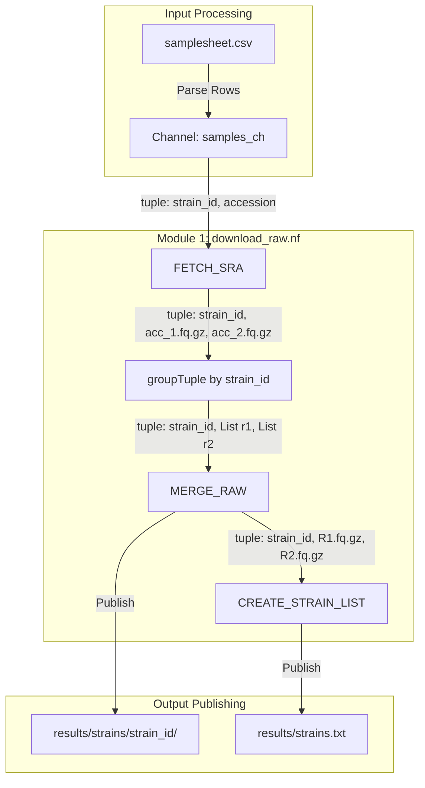

# 📖 Module 1: Data Acquisition & Strain Aggregation

* **Module Source:** `modules/download_raw.nf`
* **Pipeline Version:** `1.0.0`
* **Author:** Nextflow Workflow Maintainer
* **Last Updated:** 22 July 2026

---

## 1. Overview & Purpose

Module 1 handles the automated ingestion of biological sequence metadata, parallel retrieval of raw paired-end FASTQ datasets from European Nucleotide Archive (ENA) mirrors, aggregation of run-level files by biological strain, and generation of run inventory manifests.

### Key Objectives

* **Parallel Acquisition:** Download forward (`_1`) and reverse (`_2`) reads concurrently per SRA accession.
* **Strain-Level Concatenation:** Combine multiple run accessions associated with a single strain identifier into unified FASTQ pairs.
* **Integrity Validation:** Perform archive verification (`gzip -t`) prior to publishing outputs.
* **Manifest Generation:** Generate a clean, deduplicated list of processed strains (`strains.txt`) for downstream processing.

---

## 2. Process Architecture



---

## 3. Input & Output Data Contracts

### 3.1 Input Channel Schema (`samplesheet.csv`)

| Column Header | Data Type | Required | Description | Example |
| --- | --- | --- | --- | --- |
| `strain_id` | `String` | **Yes** | Biological strain/sample identifier | `WLP830` |
| `accession` | `String` | **Yes** | SRA/ENA Run Accession Number | `SRR10047172` |

### 3.2 Output Directory Structure

```text
results/
├── strains.txt
└── strains/
    ├── <strain_id_1>/
    │   ├── <strain_id_1>_R1.fastq.gz
    │   └── <strain_id_1>_R2.fastq.gz
    └── <strain_id_2>/
        ├── <strain_id_2>_R1.fastq.gz
        └── <strain_id_2>_R2.fastq.gz

```

---

## 4. Detailed Process Specifications

### 4.1 Process: `FETCH_SRA`

Fetches individual FASTQ run files from ENA's FTP mirror using direct dynamic URL pathing.

```nextflow
process FETCH_SRA {
    tag { "${strain_id} - ${accession}" }
    cpus 2
    memory 4.GB

    errorStrategy { task.exitStatus in [1, 143, 137, 255] ? 'retry' : 'finish' }
    maxRetries 3

    input:
    tuple val(strain_id), val(accession)

    output:
    tuple val(strain_id), path("${accession}_1.fastq.gz"), path("${accession}_2.fastq.gz")
}

```

* **Execution Directives:**
* **Threads:** 2 CPUs
* **Memory Allocation:** 4 GB
* **Retry Policy:** Automatic retry on network timeout/disconnect (Exit Codes: 1, 137, 143, 255). Up to 3 attempts.


* **Terminal Display Format:** `FETCH_SRA (WLP830 - SRR10047172)`

---

### 4.2 Process: `MERGE_RAW`

Concatenates all run-level FASTQ files for a given strain and verifies archive integrity.

```nextflow
process MERGE_RAW {
    tag { "${strain_id}" }
    cpus 2
    memory 4.GB

    publishDir path: { "results/strains/${strain_id}" }, mode: 'copy'

    input:
    tuple val(strain_id), path(r1_files), path(r2_files)

    output:
    tuple val(strain_id), path("${strain_id}_R1.fastq.gz"), path("${strain_id}_R2.fastq.gz"), emit: merged_reads
}

```

* **Execution Directives:**
* **Threads:** 2 CPUs
* **Memory Allocation:** 4 GB
* **Publish Path:** `results/strains/${strain_id}/`


* **Integrity Guarantee:** Executes `gzip -t` on final concatenated files. If corruption is detected, the process throws a non-zero exit code to halt downstream tasks.

---

### 4.3 Process: `CREATE_STRAIN_LIST`

Generates a master plain-text record of all uniquely processed strain IDs.

```nextflow
process CREATE_STRAIN_LIST {
    publishDir path: { "results" }, mode: 'copy'

    input:
    val strain_ids

    output:
    path "strains.txt"
}

```

* **Execution Directives:**
* **Publish Path:** `results/strains.txt`


---

## 5. Module Source Code (`modules/download_raw.nf`)

```nextflow
process FETCH_SRA {
    tag { "${strain_id} - ${accession}" }
    cpus 2
    memory 4.GB

    errorStrategy { task.exitStatus in [1, 143, 137, 255] ? 'retry' : 'finish' }
    maxRetries 3

    input:
    tuple val(strain_id), val(accession)

    output:
    tuple val(strain_id), path("${accession}_1.fastq.gz"), path("${accession}_2.fastq.gz")

    script:
    """
    LEN=\$(echo -n "${accession}" | wc -c)
    ACC_PREFIX=\$(echo "${accession}" | cut -c 1-6)

    if [ \$LEN -eq 9 ]; then
        BASE_URL="https://ftp.sra.ebi.ac.uk/vol1/fastq/\${ACC_PREFIX}/${accession}"
    elif [ \$LEN -eq 10 ]; then
        SUBDIR="00\$(echo "${accession}" | tail -c 2)"
        BASE_URL="https://ftp.sra.ebi.ac.uk/vol1/fastq/\${ACC_PREFIX}/\${SUBDIR}/${accession}"
    elif [ \$LEN -eq 11 ]; then
        SUBDIR="0\$(echo "${accession}" | tail -c 3)"
        BASE_URL="https://ftp.sra.ebi.ac.uk/vol1/fastq/\${ACC_PREFIX}/\${SUBDIR}/${accession}"
    else
        SUBDIR="\$(echo "${accession}" | tail -c 4)"
        BASE_URL="https://ftp.sra.ebi.ac.uk/vol1/fastq/\${ACC_PREFIX}/\${SUBDIR}/${accession}"
    fi

    CURL_OPTS="-# --retry 5 --retry-delay 2 --retry-max-time 60 -L"

    echo "Downloading ${accession}_1.fastq.gz & ${accession}_2.fastq.gz..."
    curl \$CURL_OPTS "\${BASE_URL}/${accession}_1.fastq.gz" -o "${accession}_1.fastq.gz" &
    PID1=\$!
    curl \$CURL_OPTS "\${BASE_URL}/${accession}_2.fastq.gz" -o "${accession}_2.fastq.gz" &
    PID2=\$!

    wait \$PID1 \$PID2
    """
}

process MERGE_RAW {
    tag { "${strain_id}" }
    cpus 2
    memory 4.GB

    publishDir path: { "results/strains/${strain_id}" }, mode: 'copy'

    input:
    tuple val(strain_id), path(r1_files), path(r2_files)

    output:
    tuple val(strain_id), path("${strain_id}_R1.fastq.gz"), path("${strain_id}_R2.fastq.gz"), emit: merged_reads

    script:
    """
    echo "=== Merging run FASTQs for strain: ${strain_id} ==="
    cat ${r1_files} > "${strain_id}_R1.fastq.gz"
    cat ${r2_files} > "${strain_id}_R2.fastq.gz"

    gzip -t "${strain_id}_R1.fastq.gz"
    gzip -t "${strain_id}_R2.fastq.gz"
    """
}

process CREATE_STRAIN_LIST {
    publishDir path: { "results" }, mode: 'copy'

    input:
    val strain_ids

    output:
    path "strains.txt"

    script:
    def list_str = strain_ids.unique().join("\n")
    """
    echo "${list_str}" > strains.txt
    """
}

```
