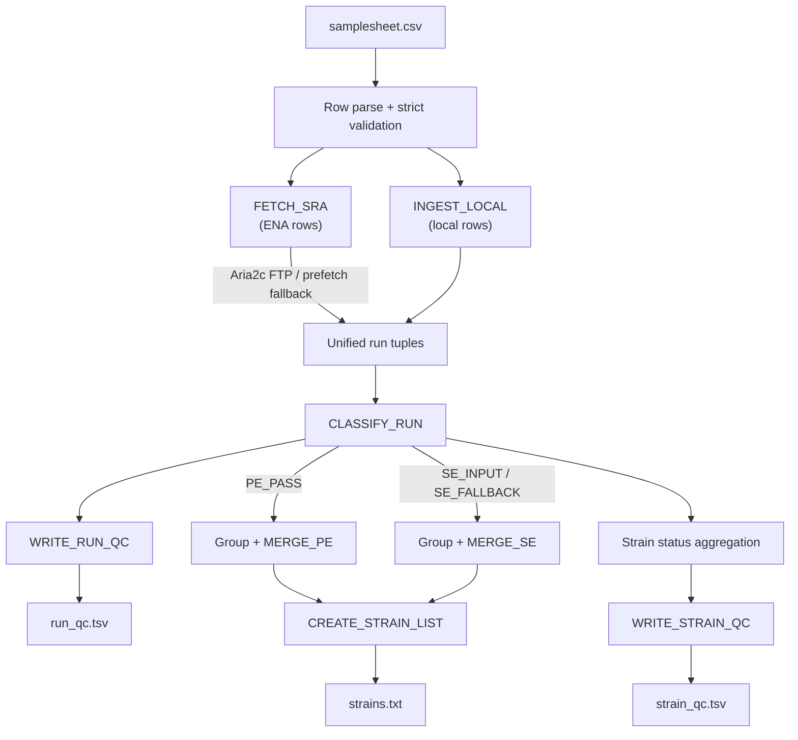

---

# 📖 Module 1: Data Acquisition, QC Classification & Strain Aggregation

* **Repository:** `hanzala-14/saccharomyces-genomics-pipeline`
* **Module Source:** `modules/download_raw.nf`
* **Workflow Source:** `main.nf`
* **Pipeline Configuration:** `nextflow.config`
* **Companion Naming/Contract Doc:** `MODULE_1_INPUT_NAMING_AND_CONTRACTS.md`
* **Pipeline Version:** `2.1.0`
* **Last Updated:** `05 August 2026`

---

## 1) Purpose & Scope

Module 1 is responsible for robustly converting user-provided metadata into strain-level FASTQ assets that are safe for downstream genomic analysis.

It handles:

1. strict samplesheet parsing and validation,
2. dual-strategy ingestion from ENA accessions (Multi-threaded Aria2c + `prefetch`/`fasterq-dump` fallback) and/or local FASTQ paths,
3. per-run quality/consistency checks (mean read length, gzip integrity, checksum identity),
4. run classification (`PE_PASS`, `SE_INPUT`, `SE_FALLBACK`, `DROP`),
5. deterministic strain-level merges,
6. audit-ready run and strain QC reports.

This module is designed for large cohort processing (tho## Configuration Parameters

The following parameters in `nextflow.config` govern the behavior of Module 1:

## Configuration Parameters

The following parameters in `nextflow.config` govern the behavior of Module 1:

### Data Acquisition & Tuning
| Parameter | Default | Description |
| :--- | :--- | :--- |
| `max_Retries` | `5` | Maximum number of network retry attempts for ENA and NCBI fallback downloads. |
| `sra_max_forks` | `4` | Maximum number of simultaneous strain downloads. Increase this if you have high bandwidth (e.g., Gigabit ethernet). |
| `aria2c_connections` | `16` | Number of simultaneous connections *per file* (`-x` and `-s`) to bypass ENA server-side throttling. |

### Quality Thresholds
| Parameter | Default | Description |
| :--- | :--- | :--- |
| `min_r2_len` | `30` | Minimum average read length (bp) of the first 2,000 reads to accept a reverse read (R2) as valid. If it fails, the run falls back to Single-End mode. |

---

## 2) Design Principles

### 2.1 Fail-safe, not fail-silent

The pipeline should not silently ignore problematic data. Every run decision and reason is explicitly recorded in QC outputs.

### 2.2 Fail-fast validation

Local file paths are resolved with `file(checkIfExists: true)` at channel creation time. Missing files abort the pipeline immediately — before any processes execute — rather than failing deep inside a task.

### 2.3 Maximum salvage with transparent classification

Instead of dropping entire strains due to imperfect pairing or missing ENA mate files, the module safely falls back to single-end when justified.

### 2.4 Multi-strategy resilience & Bandwidth Saturation

Network downloads prioritize multi-threaded ENA FTP transfers via `aria2c` (16 connections per file) to bypass server-side throttling. The pipeline utilizes `maxForks` concurrency to saturate available network bandwidth. If direct ENA mirrors are corrupt or unreachable, it falls back automatically to the SRA toolkit's reliable `prefetch` $\rightarrow$ `fasterq-dump` workflow.

### 2.5 Determinism & Traceability

Equivalent inputs generate equivalent merged outputs. Every run is traceable via `strain_id` + `run_id`:

* **ENA runs:** `run_id` = accession (e.g., `SRR10047173`)
* **Local runs:** `run_id` = `LOCAL_<strain_id>_<r1_basename>` (sanitized regex `[^A-Za-z0-9_.-]` $\rightarrow$ `_`)

---

## 3) End-to-End Workflow



---

## 4) Input Contract (Operational)

### 4.1 Required samplesheet columns

```csv
strain_id,accession,r1,r2


```

### 4.2 Valid row modes

1. **ENA mode**

* `accession` populated (Run Accession: `SRR`, `ERR`, `DRR`)
* `r1` and `r2` empty

2. **Local mode**

* `r1` populated (absolute or relative path)
* `r2` optional
* `accession` empty

### 4.3 Invalid combinations

* both accession and r1 missing,
* accession mixed with local paths in same row.

### 4.4 Path resolution

Local paths (`r1`, `r2`) are resolved at startup using Nextflow's `file()` function with `checkIfExists: true`. This means:

* absolute paths are used as-is,
* relative paths are resolved from the launch directory,
* missing files cause an immediate, clear error before any process runs.

---

## 5) Process-by-Process Specification

### 5.1 `FETCH_SRA`

**Role:** High-speed download of ENA/SRA FASTQ mates using a dual-strategy approach optimized to reduce local CPU overhead and maximize network bandwidth.

* **Label:** `base`
* **Error Strategy:** Retry on exit codes `1, 137, 143, 255` up to `maxRetries 5`
* **Input tuple:** `(strain_id, accession)`
* **Output tuple:** `(strain_id, accession, path("${accession}_1.fastq.gz"), path("${accession}_2.fastq.gz"))`

#### Execution Logic

1. **Accession Validation:** Checks format via regex `^[A-Z]{3}\d{6,8}$`.
2. **SRA Toolkit Configuration:** Dynamically generates a `.ncbi/user-settings.mkfg` file to strictly disable interactive prompts and cloud-reporting, preventing silent pipeline hangs.
3. **Directory Resolution:** Constructs ENA FTP base URL according to accession character length (handles 9–12 character conventions).
4. **Strategy 1 (Direct ENA via Aria2c):** Attempts to pull pre-compressed `.fastq.gz` files directly from ENA using `aria2c -x 16 -s 16` to bypass per-connection rate limits. Validates gzip integrity via `gzip -t`.
5. **Strategy 2 (NCBI Fallback):** If Strategy 1 fails or returns corrupt data, executes `prefetch` to safely cache the `.sra` blob, followed by `fasterq-dump` to extract the raw FASTQ data. Data is then aggressively compressed using `pigz` (if available) or `gzip`.
6. **Placeholder Creation:** If R2 is absent (e.g., single-end run), creates an empty placeholder `touch "${accession}_2.fastq.gz"` for downstream processing.

---

### 5.2 `INGEST_LOCAL`

**Role:** Standardize local FASTQ file paths into canonical run tuple artifacts.

* **Label:** `tiny`
* **Input tuple:** `(strain_id, r1_file, r2_file)`
* **Output tuple:** `(strain_id, run_id, path("${run_id}_R1.fastq.gz"), path("${run_id}_R2.fastq.gz"))`

#### Execution Logic

* Generates `run_id`: `LOCAL_${strain_id}_${r1_file.baseName}` with special characters sanitized to underscores.
* Copies staged `r1_file` to `${run_id}_R1.fastq.gz`.
* If `r2_file` is not the `EMPTY` placeholder and is non-empty, copies it to `${run_id}_R2.fastq.gz`; otherwise, creates an empty file (`: > "${run_id}_R2.fastq.gz"`).

---

### 5.3 `CLASSIFY_RUN`

**Role:** Evaluate run integrity, estimate read lengths, and classify usability status.

* **Label:** `tiny`
* **Input tuple:** `(strain_id, run_id, path(r1), path(r2))`
* **Output tuple (emit: qc_rows):** `(strain_id, run_id, stdout, path(r1), path(r2))`

#### Classification Matrix & Reason Codes

| Status | Reason | Trigger Condition |
| --- | --- | --- |
| `PE_PASS` | `OK` | Both mates valid, R1/R2 MD5 distinct, $R2 \ge \text{params.min\_r2\_len}$ |
| `SE_FALLBACK` | `R1_R2_IDENTICAL` | R1 and R2 pass validation but have identical MD5 checksums |
| `SE_FALLBACK` | `R2_TOO_SHORT` | Both mates valid, but mean length of R2 is under `params.min_r2_len` |
| `SE_FALLBACK` | `R2_INVALID_OR_MISSING` | ENA run: R1 is valid, but R2 is missing, zero-byte, or corrupted |
| `SE_INPUT` | `LOCAL_R1_ONLY_OR_BAD_R2` | Local run: R1 is valid, but R2 is missing or corrupted |
| `DROP` | `R1_INVALID` | R1 is missing, zero-byte, or fails `gzip -t` test |

#### Read Length Sampling

Mean read length (`r1_len`, `r2_len`) is estimated in Python by streaming the first 2,000 sequence lines (every 4th line starting at index 2) of each gzip file.

---

### 5.4 `MERGE_PE`

**Role:** Concatenate paired-end runs belonging to the same strain.

* **Label:** `base`
* **Publish Path:** `${params.outdir}/strains/${strain_id}` (`mode: 'copy'`)
* **Input tuple:** `(strain_id, path(r1_files), path(r2_files))`
* **Output tuple (emit: merged_pe):** `(strain_id, path("${strain_id}_PE_R1.fastq.gz"), path("${strain_id}_PE_R2.fastq.gz"))`

#### Execution Logic

* Concatenates ordered R1 files to `${strain_id}_PE_R1.fastq.gz` and R2 files to `${strain_id}_PE_R2.fastq.gz`.
* Performs post-merge integrity checks via `gzip -t` on both output files.

---

### 5.5 `MERGE_SE`

**Role:** Concatenate single-end (or downgraded fallback) runs belonging to the same strain.

* **Label:** `base`
* **Publish Path:** `${params.outdir}/strains/${strain_id}` (`mode: 'copy'`)
* **Input tuple:** `(strain_id, path(r1_files))`
* **Output tuple (emit: merged_se):** `(strain_id, path("${strain_id}_SE.fastq.gz"))`

#### Execution Logic

* Concatenates ordered single-end files into `${strain_id}_SE.fastq.gz`.
* Performs post-merge integrity check via `gzip -t`.

---

### 5.6 `CREATE_STRAIN_LIST`

**Role:** Generate a deduplicated, sorted master list of processed strains.

* **Label:** `tiny`
* **Publish Path:** `${params.outdir}` (`mode: 'copy'`)
* **Input:** `val strain_ids`
* **Output:** `path "strains.txt"`

---

### 5.7 `WRITE_RUN_QC`

**Role:** Write audit report detailing every run attempt and its outcome.

* **Label:** `tiny`
* **Publish Path:** `${params.outdir}` (`mode: 'copy'`)
* **Input:** `val rows`
* **Output:** `path "run_qc.tsv"`
* **Columns:** `strain_id`, `run_id`, `status`, `reason`, `r1_mean_len`, `r2_mean_len`

---

### 5.8 `WRITE_STRAIN_QC`

**Role:** Aggregate per-run results into a strain-level summary.

* **Label:** `tiny`
* **Publish Path:** `${params.outdir}` (`mode: 'copy'`)
* **Input:** `val rows`
* **Output:** `path "strain_qc.tsv"`
* **Columns:** `strain_id`, `pe_runs`, `se_runs`, `dropped_runs`, `final_mode`
* **Possible `final_mode` values:** `PE_ONLY`, `SE_ONLY`, `MIXED`, `ALL_DROPPED`

---

## 6) Output Layout

```text
results/
├── strains.txt
├── run_qc.tsv
├── strain_qc.tsv
├── pipeline_report.html
├── pipeline_timeline.html
├── pipeline_trace.txt
├── pipeline_dag.html
└── strains/
    ├── <strain_A>/
    │   ├── <strain_A>_PE_R1.fastq.gz    (if PE exists)
    │   ├── <strain_A>_PE_R2.fastq.gz    (if PE exists)
    │   └── <strain_A>_SE.fastq.gz       (if SE exists)
    └── <strain_B>/
        └── ...


```

---

## 7) Operational Recommendations

1. **Pilot Run:** Execute a subset (100–200 strains) before launching a large-scale run.
2. **Review Metrics:** Check `run_qc.tsv` and `strain_qc.tsv` for percentages of `PE_PASS`, `SE_FALLBACK`, and `DROP`.
3. **Threshold Tuning:** Modify `params.min_r2_len` in `nextflow.config` if short read lengths in R2 are expected for specific library preps.
4. **Execution Resume:** Re-runs should always use `-resume` to leverage Nextflow's task caching for completed processes.

---

## 8) Change Management Rule

Any logic change affecting ingestion, classification rules, process signatures, or output filenames must update:

1. `docs/MODULE_1_DATA_ACQUISITION.md` (this file), and
2. `docs/MODULE_1_INPUT_NAMING_AND_CONTRACTS.md`.

This guarantees implementation and documentation remain synchronized throughout pipeline development.