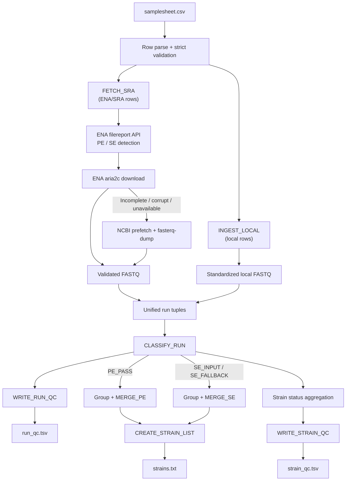

---

# 📖 Module 1: Data Acquisition, QC Classification & Strain Aggregation

* **Repository:** `hanzala-14/saccharomyces-genomics-pipeline`
* **Module Source:** `modules/download_raw.nf`
* **Workflow Source:** `main.nf`
* **Pipeline Configuration:** `nextflow.config`
* **Companion Naming/Contract Doc:** `MODULE_1_INPUT_NAMING_AND_CONTRACTS.md`
* **Pipeline Version:** `2.1.1`
* **Last Updated:** 06 September 2026

---

## 1) Purpose & Scope

Module 1 is responsible for robustly converting user-provided metadata into strain-level FASTQ assets that are safe for downstream genomic analysis.

It handles:

1. strict samplesheet parsing and validation,
2. dual-strategy ingestion from ENA/SRA accessions and/or local FASTQ paths,
3. ENA metadata-based determination of paired-end (PE) versus single-end (SE) layout,
4. primary direct ENA download using multi-threaded `aria2c`,
5. secondary NCBI SRA `prefetch` → `fasterq-dump` fallback,
6. per-run quality and consistency checks including gzip integrity, mean read length, and checksum identity,
7. run classification (`PE_PASS`, `SE_INPUT`, `SE_FALLBACK`, `DROP`),
8. deterministic strain-level merges,
9. audit-ready run and strain QC reports.

The module is designed for large cohort processing while prioritizing **input integrity, transparent failure handling, retryability, and reproducibility**.

---

## Configuration Parameters

The following parameters in `nextflow.config` govern the behavior of Module 1:

### Data Acquisition & Tuning

| Parameter                 | Default   | Description                                                                 |
| :------------------------ | :-------- | :-------------------------------------------------------------------------- |
| `max_Retries`             | `5`       | Maximum number of Nextflow task-level retries for failed acquisition tasks. |
| `sra_max_forks`           | `4`       | Maximum number of simultaneous SRA accession download tasks.                |
| `aria2c_connections`      | `16`      | Number of parallel connections per file used by `aria2c`.                   |
| `aria2c_min_split_size`   | `1M`      | Minimum chunk size used when splitting ENA downloads.                       |
| `aria2c_connect_timeout`  | `30`      | Maximum seconds allowed to establish an ENA connection.                     |
| `aria2c_timeout`          | `60`      | Maximum seconds allowed for a stalled ENA transfer.                         |
| `aria2c_max_tries`        | `3`       | Number of connection/download retries performed internally by `aria2c`.     |
| `aria2c_retry_wait`       | `10`      | Seconds to wait between `aria2c` retry attempts.                            |
| `aria2c_summary_interval` | `10`      | Seconds between `aria2c` progress summaries.                                |
| `fetch_retry_sleep`       | `10`      | Base delay in seconds before a repeated Nextflow `FETCH_SRA` task attempt.  |
| `ena_api_max_time`        | `60`      | Maximum seconds allowed for the ENA metadata API request.                   |
| `ena_api_retries`         | `3`       | Number of retries for ENA metadata API requests.                            |
| `ena_api_retry_wait`      | `5`       | Seconds to wait between ENA metadata API retries.                           |
| `ncbi_dir`                | `~/.ncbi` | SRA Toolkit configuration directory.                                        |
| `prefetch_timeout`        | `3600`    | Maximum seconds allowed for the NCBI `prefetch` fallback.                   |
| `prefetch_max_size`       | `50G`     | Maximum SRA download size permitted by the NCBI fallback.                   |
| `fasterq_timeout`         | `1800`    | Maximum seconds allowed for `fasterq-dump`.                                 |

### Quality Thresholds

| Parameter    | Default | Description                                                                                    |
| :----------- | :------ | :--------------------------------------------------------------------------------------------- |
| `min_r2_len` | `30`    | Minimum average R2 read length (bp) used by `CLASSIFY_RUN` when assessing paired-end validity. |

---

## 2) Design Principles

### 2.1 Fail-safe, not fail-silent

The pipeline should not silently ignore problematic data. Download failures, incomplete files, corrupted FASTQ files, and classification decisions are explicitly handled and recorded in QC outputs.

### 2.2 Fail-fast validation

Local file paths are resolved with `file(checkIfExists: true)` at channel creation time. Missing files abort the pipeline immediately — before any processes execute — rather than failing deep inside a task.

### 2.3 Explicit PE/SE determination

For ENA/SRA accessions, the module queries the ENA filereport API before downloading reads. This determines whether the accession is genuinely paired-end or single-end and prevents a failed R2 download from being mistaken for legitimate SE data.

### 2.4 Multi-strategy resilience & bandwidth utilization

Network downloads prioritize direct ENA FASTQ retrieval through `aria2c`. For PE runs, both R1 and R2 must download successfully and pass integrity checks before the ENA strategy is considered successful.

If the ENA download is incomplete, corrupt, or unavailable, the module falls back to the NCBI SRA Toolkit `prefetch` → `fasterq-dump` workflow.

### 2.5 Retry-aware failure handling

A required download failure produces a non-zero exit status so that Nextflow's configured retry mechanism can act on the failed task.

This creates multiple levels of resilience:

```text
aria2c internal retries
        ↓
NCBI fallback
        ↓
Nextflow task retry
```

### 2.6 Determinism & Traceability

Equivalent inputs generate equivalent merged outputs. Every run is traceable via `strain_id` + `run_id`:

* **ENA runs:** `run_id` = accession (e.g., `SRR10047173`)
* **Local runs:** `run_id` = `LOCAL_<strain_id>_<r1_basename>` (sanitized regex `[^A-Za-z0-9_.-]` → `_`)

---

## 3) End-to-End Workflow



---

## 4) Input Contract (Operational)

### 4.1 Required samplesheet columns

```csv
strain_id,accession,r1,r2
```

### 4.2 Valid row modes

1. **ENA/SRA mode**

* `accession` populated (Run Accession: `SRR`, `ERR`, `DRR`)
* `r1` and `r2` empty

2. **Local mode**

* `r1` populated (absolute or relative path)
* `r2` optional
* `accession` empty

### 4.3 Invalid combinations

* both accession and `r1` missing,
* accession mixed with local paths in the same row.

### 4.4 Path resolution

Local paths (`r1`, `r2`) are resolved at startup using Nextflow's `file()` function with `checkIfExists: true`. This means:

* absolute paths are used as-is,
* relative paths are resolved from the launch directory,
* missing files cause an immediate, clear error before any process runs.

---

## 5) Process-by-Process Specification

### 5.1 `FETCH_SRA`

**Role:** Robust acquisition of ENA/SRA FASTQ data using metadata-driven layout detection, direct ENA download, NCBI fallback, integrity validation, and retry-aware failure handling.

* **Label:** `base`
* **Error Strategy:** Retry on exit codes `1, 137, 143, 255`
* **Maximum Task Retries:** `params.max_Retries`
* **Input tuple:** `(strain_id, accession)`
* **Output tuple:** `(strain_id, accession, path("${accession}_1.fastq.gz"), path("${accession}_2.fastq.gz"))`

#### Execution Logic

1. **Accession Validation:** Checks the accession format using `^[A-Z]{3}\d{6,8}$`.

2. **SRA Toolkit Configuration:** Dynamically generates the NCBI configuration file and exports the required environment variables to suppress unwanted interactive behavior and cloud-related reporting.

3. **ENA Metadata Query:** Queries the ENA filereport API before downloading the FASTQ files.

   The metadata query provides the authoritative FASTQ file locations and allows the module to determine whether the run is:

   * `PE` — both R1 and R2 are reported,
   * `SE` — only one FASTQ file is reported,
   * `UNKNOWN` — metadata could not be obtained.

4. **Strategy 1 — Direct ENA via `aria2c`:**

   * Uses the exact FASTQ URLs returned by ENA.
   * Uses configurable parallel connections and network timeouts.
   * For PE runs, **both R1 and R2 must successfully download**.
   * Both files must be non-empty and pass `gzip -t`.
   * A successful R1 download alone is **not sufficient** to declare an ENA PE run successful.
   * If any required PE download is incomplete or corrupt, the partial files are removed and the NCBI fallback is attempted.

5. **Strategy 2 — NCBI SRA fallback:**

   If the ENA strategy cannot produce a valid dataset, the module executes:

   ```text
   prefetch
       ↓
   fasterq-dump --split-files
       ↓
   FASTQ compression
   ```

   `pigz` is used when available; otherwise standard `gzip` is used.

6. **Final Validation:**

   R1 must always be present, non-empty, and pass `gzip -t`.

   For runs identified by ENA as PE, R2 must also be present, non-empty, and pass `gzip -t`.

   A PE run with missing/corrupt R2 causes the process to exit with status `1`, allowing Nextflow to retry the task.

7. **Genuine SE Handling:**

   For SE runs, only R1 is required. An empty R2 placeholder is produced to maintain the module's standardized output interface for downstream processes.

8. **Retry Behavior:**

   Download recovery occurs at multiple levels:

   ```text
   aria2c internal retries
          ↓
   NCBI fallback
          ↓
   Nextflow task retry
   ```

   This prevents temporary ENA connection errors from silently converting valid PE datasets into SE datasets.

---

### 5.2 `INGEST_LOCAL`

**Role:** Standardize local FASTQ file paths into canonical run tuple artifacts.

* **Label:** `tiny`
* **Input tuple:** `(strain_id, r1_file, r2_file)`
* **Output tuple:** `(strain_id, run_id, path("${run_id}_R1.fastq.gz"), path("${run_id}_R2.fastq.gz"))`

#### Execution Logic

* Generates `run_id`: `LOCAL_${strain_id}_${r1_file.baseName}` with special characters sanitized to underscores.
* Copies `r1_file` to `${run_id}_R1.fastq.gz`.
* If `r2_file` is not the `EMPTY` placeholder and is non-empty, copies it to `${run_id}_R2.fastq.gz`.
* Otherwise, creates an empty R2 file for downstream classification.

---

### 5.3 `CLASSIFY_RUN`

**Role:** Evaluate run integrity, estimate read lengths, identify suspicious pairing, and classify usability status.

* **Label:** `tiny`
* **Input tuple:** `(strain_id, run_id, path(r1), path(r2))`
* **Output tuple (emit: qc_rows):** `(strain_id, run_id, stdout, path(r1), path(r2))`

#### Classification Matrix & Reason Codes

| Status        | Reason                    | Trigger Condition                                                              |
| ------------- | ------------------------- | ------------------------------------------------------------------------------ |
| `PE_PASS`     | `OK`                      | Both mates valid, R1/R2 MD5 distinct, and `R2 >= params.min_r2_len`            |
| `SE_FALLBACK` | `R1_R2_IDENTICAL`         | R1 and R2 pass validation but have identical MD5 checksums                     |
| `SE_FALLBACK` | `R2_TOO_SHORT`            | Both mates are valid, but the mean R2 read length is below `params.min_r2_len` |
| `SE_FALLBACK` | `R2_INVALID_OR_MISSING`   | ENA/SRA run has valid R1 but invalid or missing R2                             |
| `SE_INPUT`    | `LOCAL_R1_ONLY_OR_BAD_R2` | Local input has valid R1 but missing or invalid R2                             |
| `DROP`        | `R1_INVALID`              | R1 is missing, zero-byte, or fails `gzip -t`                                   |

> **Note:** With the current `FETCH_SRA` implementation, a run that ENA explicitly reports as PE is prevented from reaching this stage with a missing/corrupt R2 under normal successful execution. The `R2_INVALID_OR_MISSING` classification remains as a defensive QC condition for ENA-derived run tuples and previously generated/incomplete inputs.

#### Read Length Sampling

Mean read length (`r1_len`, `r2_len`) is estimated in Python by streaming up to the first 2,000 sequence records from each gzip FASTQ file.

---

### 5.4 `MERGE_PE`

**Role:** Concatenate validated paired-end runs belonging to the same strain.

* **Label:** `base`
* **Publish Path:** `${params.outdir}/Strains/${strain_id}` (`mode: 'copy'`)
* **Input tuple:** `(strain_id, path(r1_files), path(r2_files))`
* **Output tuple (emit: merged_pe):** `(strain_id, path("${strain_id}_PE_R1.fastq.gz"), path("${strain_id}_PE_R2.fastq.gz"))`

#### Execution Logic

* Concatenates ordered R1 files to `${strain_id}_PE_R1.fastq.gz`.
* Concatenates ordered R2 files to `${strain_id}_PE_R2.fastq.gz`.
* Performs post-merge integrity checks using `gzip -t` on both outputs.

---

### 5.5 `MERGE_SE`

**Role:** Concatenate single-end or explicitly downgraded runs belonging to the same strain.

* **Label:** `base`
* **Publish Path:** `${params.outdir}/Strains/${strain_id}` (`mode: 'copy'`)
* **Input tuple:** `(strain_id, path(r1_files))`
* **Output tuple (emit: merged_se):** `(strain_id, path("${strain_id}_SE.fastq.gz"))`

#### Execution Logic

* Concatenates ordered single-end R1 files into `${strain_id}_SE.fastq.gz`.
* Performs post-merge integrity validation using `gzip -t`.

---

### 5.6 `CREATE_STRAIN_LIST`

**Role:** Generate a deduplicated, sorted master list of processed strains.

* **Label:** `tiny`
* **Publish Path:** `${params.outdir}/Strains/`
* **Input:** `val strain_ids`
* **Output:** `path "strains.txt"`

---

### 5.7 `WRITE_RUN_QC`

**Role:** Write an audit report detailing every run and its classification outcome.

* **Label:** `tiny`
* **Publish Path:** `${params.outdir}/Strains/`
* **Input:** `val rows`
* **Output:** `path "run_qc.tsv"`
* **Columns:** `strain_id`, `run_id`, `status`, `reason`, `r1_mean_len`, `r2_mean_len`

---

### 5.8 `WRITE_STRAIN_QC`

**Role:** Aggregate per-run results into a strain-level summary.

* **Label:** `tiny`
* **Publish Path:** `${params.outdir}/Strains/`
* **Input:** `val rows`
* **Output:** `path "strain_qc.tsv"`
* **Columns:** `strain_id`, `pe_runs`, `se_runs`, `dropped_runs`, `final_mode`

#### Possible `final_mode` values

* `PE_ONLY`
* `SE_ONLY`
* `MIXED`
* `ALL_DROPPED`

---

## 6) Output Layout

```text
results/
├── strains.txt
├── run_qc.tsv
├── strain_qc.tsv
├── Pipeline_Info/
│   ├── execution_report.html
│   ├── execution_timeline.html
│   └── pipeline_dag.html
└── Strains/
    ├── <strain_A>/
    │   ├── <strain_A>_PE_R1.fastq.gz    (if PE exists)
    │   ├── <strain_A>_PE_R2.fastq.gz    (if PE exists)
    │   └── <strain_A>_SE.fastq.gz       (if SE exists)
    └── <strain_B>/
        └── ...
```

---

## 7) Operational Recommendations

1. **Pilot Run:** Execute a small representative subset before launching a large-scale cohort run.

2. **Review Acquisition QC:** Check `run_qc.tsv` and `strain_qc.tsv` for unexpected `SE_FALLBACK`, `DROP`, or abnormal read-length patterns.

3. **Review Download Failures:** Inspect the `FETCH_SRA` task logs when ENA downloads fail or fall back to NCBI. A PE run should never be silently accepted with a missing or zero-byte R2.

4. **Threshold Tuning:** Modify `params.min_r2_len` in `nextflow.config` when library-specific read-length characteristics justify a different threshold.

5. **Execution Resume:** Use `-resume` when intentionally continuing or recovering an interrupted run and when the existing work directory should be reused. For a completely fresh validation run, start without `-resume` using a clean output/workspace.

---

## 8) Change Management Rule

Any logic change affecting ingestion, ENA/SRA acquisition, layout detection, classification rules, process signatures, or output filenames must update:

1. `docs/MODULE_1_DATA_ACQUISITION.md` (this file), and
2. `docs/MODULE_1_INPUT_NAMING_AND_CONTRACTS.md`.

This guarantees implementation and documentation remain synchronized throughout pipeline development.

---